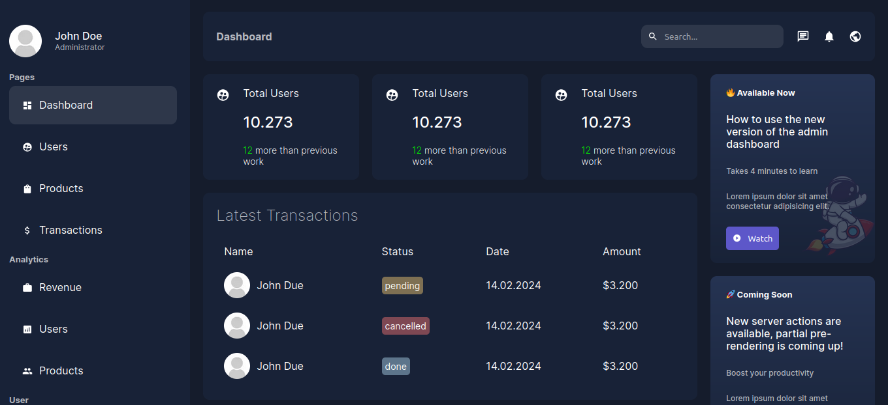

# Next Admin

Dashboard with mongodb and nextjs 14




## Development

### Env Default
```env
MONGO_URL=mongodb://mongo:27017/db
ITEM_PER_PAGE=2
```

> Defaults of defined environments in `app/lib/settings.js`

### Start in development
```sh
# After creating .env file in project root
docker-compose up
```
